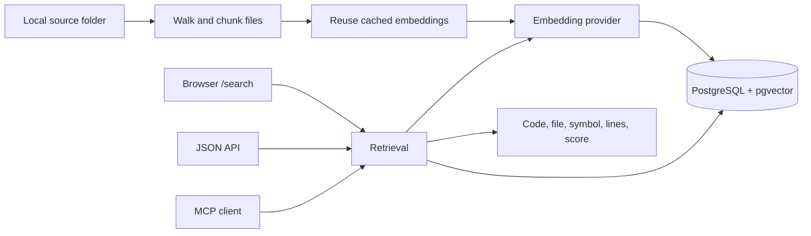

# code-rag

**Explore a codebase through natural-language search. Understand how the retrieval works.**

A reference implementation of code retrieval for anyone building something similar. Point it at a local folder, index the source files, and retrieve relevant snippets through a browser, a JSON API, or an MCP client.

The default setup runs embeddings on your CPU with FastEmbed and stores vectors in PostgreSQL with pgvector. Everything runs in Docker; no hosted embedding service is required. Other embedding providers are configurable.

[Quickstart](#quickstart) · [How it works](#how-it-works) · [MCP](#connect-an-mcp-client) · [Configuration](#configuration) · [Commands](#commands)

---

## Quickstart

You need **Docker with Compose** and **Make**. With Docker running:

```bash
git clone https://github.com/hjunior29/code-rag.git
cd code-rag

make up
make index DIR=/absolute/path/to/your/project
```

`make up` creates `.env` from [.env.example](.env.example) if it does not exist, then builds and starts the server and database. The first indexing run downloads the embedding model from Hugging Face and caches it in a Docker volume.

| Open | What you will find |
| --- | --- |
| [Interactive documentation](http://localhost:8000/) | An explanation of indexing, embeddings, similarity, and retrieval, with diagrams you can manipulate. |
| [Local search](http://localhost:8000/search) | Real search over the projects you have indexed, with project and language filters. |
| [API documentation](http://localhost:8000/docs) | FastAPI's generated documentation for the JSON endpoints. |

The website explains the implementation; indexing runs on your machine through the CLI. The documentation includes a copyable setup prompt for an assistant, with instructions to ask which folder you want to index. Both documentation and search support English, Portuguese, and light and dark themes.

### Index another project

```bash
# Use the folder name as the project name
make index DIR=/absolute/path/to/another/project

# Choose a name explicitly
make index DIR=/absolute/path/to/another/project NAME=my-project
```

The source folder is mounted **read-only** during indexing. Run the same command after changing your code to refresh the index. A project name identifies one index: indexing another folder under the same name replaces its previous contents.

## How it works



### From files to vectors

1. **Discover files.** Walk the source folder, skipping hidden directories, dependency and build directories, lockfiles, binary content, unsupported file types, and files larger than 512 KB by default.
2. **Extract snippets.** Tree-sitter extracts symbols from Python, Go, Java, TypeScript/TSX, and JavaScript. Other supported text files—and files without extracted symbols—use overlapping windows of 100 lines with 15 lines of overlap by default.
3. **Reuse previous work.** Hash the embedding input, which includes the file path, symbol name, configured prefix, and snippet content. Unchanged inputs reuse vectors from the previous index or saved checkpoints.
4. **Embed new inputs.** Generate vectors with the configured provider. Completed batches are checkpointed, so an interrupted run can reuse them on the next attempt.
5. **Replace the project index.** Write the new snippets and vectors in a transaction. Until that transaction succeeds, the previous project index remains available.

### From a question to code

The question goes through the same embedding model as the snippets. PostgreSQL ranks snippets by cosine distance, optionally filtering by project and language. Results include the code, relative file path, symbol, line range, and similarity score.

The implementation creates an HNSW index for vectors with up to 2,000 dimensions. Larger vectors use a sequential scan. A score measures similarity, rather than the probability that a result is correct.

This project provides retrieval context for an assistant; it does not generate an answer itself. When you already know a symbol name, `find_symbol` searches for exact or partial name matches without computing a query embedding.

## Connect an MCP client

The server exposes MCP over streamable HTTP at `http://localhost:8000/mcp`.

For Claude Code:

```bash
claude mcp add --transport http code-rag http://localhost:8000/mcp
```

| Tool | Parameters | Behavior |
| --- | --- | --- |
| `search_code` | `query`, `project?`, `lang?`, `top_k?` | Retrieve snippets by meaning. Defaults to 10 results; accepts 1–50. |
| `find_symbol` | `symbol`, `project?`, `top_k?` | Find exact or partial symbol names. Defaults to 20 results; accepts 1–100. |
| `list_projects` | None | List project paths, file and snippet counts, and indexing timestamps. |

For clients that use stdio, configure the following command with this repository as the working directory:

```bash
make mcp-stdio
```

Start the infrastructure with `make up` first; the stdio process uses the same database.

## Configuration

Edit `.env` to select an embedding provider and model. Vector dimensions are detected during indexing. The default configuration is:

```dotenv
COMPOSE_PROFILES=
EMBEDDING_PROVIDER=fastembed
EMBEDDING_MODEL=BAAI/bge-small-en-v1.5
EMBEDDING_BATCH_SIZE=64
EMBEDDING_CONCURRENCY=4
```

| Provider | Where embeddings run | Additional configuration |
| --- | --- | --- |
| `fastembed` | Inside the server container, using ONNX on the CPU | A model supported by FastEmbed. This is the default. |
| `ollama` | An Ollama container or an Ollama instance on your host | `OLLAMA_URL`; set `COMPOSE_PROFILES=ollama` for the bundled container. |
| `openai` | An OpenAI-compatible endpoint, local or hosted | `OPENAI_BASE_URL`, `OPENAI_API_KEY` when required. |
| `gemini` | The Gemini API | `GEMINI_API_KEY`, optional `GEMINI_OUTPUT_DIM`. |

Hosted providers send embedding inputs to their configured endpoints. Use the default FastEmbed setup or a local endpoint when you want embedding computation to stay on your machine.

### Run Ollama in Docker

```dotenv
COMPOSE_PROFILES=ollama
EMBEDDING_PROVIDER=ollama
EMBEDDING_MODEL=nomic-embed-text
OLLAMA_URL=http://ollama:11434
EMBEDDING_DOC_PREFIX="search_document: "
EMBEDDING_QUERY_PREFIX="search_query: "
```

`make up` starts the optional container and pulls the configured model. For Ollama running on the host with Docker Desktop, leave `COMPOSE_PROFILES` empty and use `OLLAMA_URL=http://host.docker.internal:11434`.

### Change the embedding model

All indexed projects in one database share the same model and vector dimensions. To switch models, back up the current index, edit `.env`, and rebuild the index:

```bash
make backup
# Edit EMBEDDING_PROVIDER / EMBEDDING_MODEL in .env
make reset-db
make up
make index DIR=/absolute/path/to/your/project
```

**`make reset-db` deletes the database volume and all indexed projects.** Reindex every project after switching; vectors from different models are incompatible.

Task prefixes are model-specific. Configure `EMBEDDING_DOC_PREFIX` and `EMBEDDING_QUERY_PREFIX` together when your model needs them, preserving any trailing spaces with quotes. Reindex after changing document prefixes or chunking settings. See [app/config.py](app/config.py) for all settings and [.env.example](.env.example) for provider examples.

## JSON API

```bash
curl --get http://localhost:8000/api/search \
  --data-urlencode 'q=where is the access token validated?' \
  --data-urlencode 'project=my-project' \
  --data-urlencode 'lang=python' \
  --data-urlencode 'top_k=5'
```

Only `q` is required. `project`, `lang`, and `top_k` are optional.

| Endpoint | Response |
| --- | --- |
| `GET /api/search` | Ranked snippets with `project`, `file_path`, `lang`, `kind`, `name`, `start_line`, `end_line`, `score`, and `content`. |
| `GET /api/projects` | Indexed projects and their statistics. |
| `GET /api/langs` | Languages present in the index. |
| `GET /health` | Server and database health. |

Returned snippet content is capped at 4,000 characters. `/how` redirects to the interactive documentation at `/`.

## Commands

| Command | Purpose |
| --- | --- |
| `make setup` | Create `.env` from the example if missing. |
| `make up` | Build and start the Docker services. |
| `make index DIR=/path [NAME=name]` | Index or refresh a source folder. |
| `make logs` | Follow server logs. |
| `make ps` | Show container status. |
| `make restart` | Restart the server container. |
| `make down` | Stop the services, keeping their data volumes. |
| `make backup` | Save a compressed database dump under `./backups`. |
| `make restore FILE=/path/backup.dump` | Restore a database dump, replacing existing database objects. |
| `make reset-db` | Delete the database volume. |
| `make mcp-stdio` | Start an MCP server over stdio. |

Set `BACKUP_DIR=/path/to/backups` to choose a different backup location. PostgreSQL is exposed on host port `5433`; the HTTP server uses port `8000`.

## Project layout

```text
app/
├── main.py                  # CLI: serve, index, mcp
├── config.py                # Environment-based settings
├── db.py                    # Connection pool, schema, vector indexes
├── embeddings/              # FastEmbed, Ollama, OpenAI-compatible, Gemini
├── indexer/
│   ├── walker.py            # File discovery and exclusions
│   ├── chunkers/            # Tree-sitter and overlapping text windows
│   └── pipeline.py          # Chunk, reuse, embed, checkpoint, store
├── search.py                # Semantic retrieval and symbol lookup
├── mcp_server.py            # MCP tools
└── web/
    ├── api.py               # FastAPI routes and MCP mount
    └── static/
        ├── index.html      # Interactive documentation
        ├── search.html     # Local search interface
        └── assets/         # Shared styles, diagrams, scripts, fonts

design-system/code-rag/MASTER.md  # UI design direction and conventions
docker-compose.yml              # Database, server, optional Ollama
Makefile                        # Local workflow commands
```

The frontend uses plain HTML, CSS, JavaScript, and SVG, with no frontend build step. Diagrams use native browser animations, support reduced motion, and suspend the opening animation when it is offscreen or the tab is hidden.

## Adapting the implementation

Start with [the indexing pipeline](app/indexer/pipeline.py) to understand how data enters the index, [the embedding interface](app/embeddings/base.py) to add a provider, and [the retrieval queries](app/search.py) to change how results are ranked or filtered. The interactive documentation connects these pieces through examples you can explore locally.
