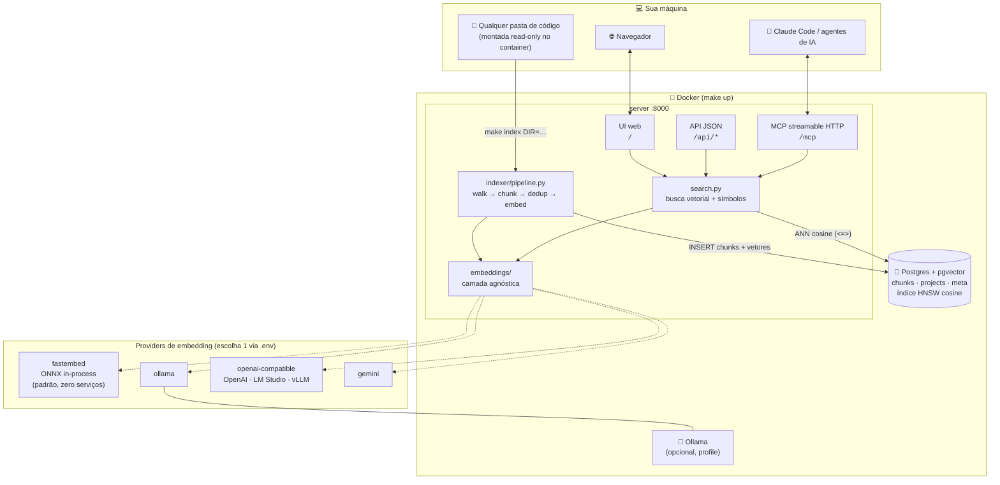
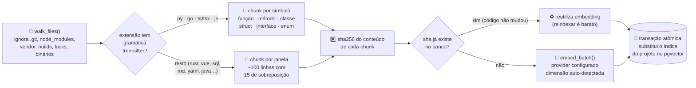
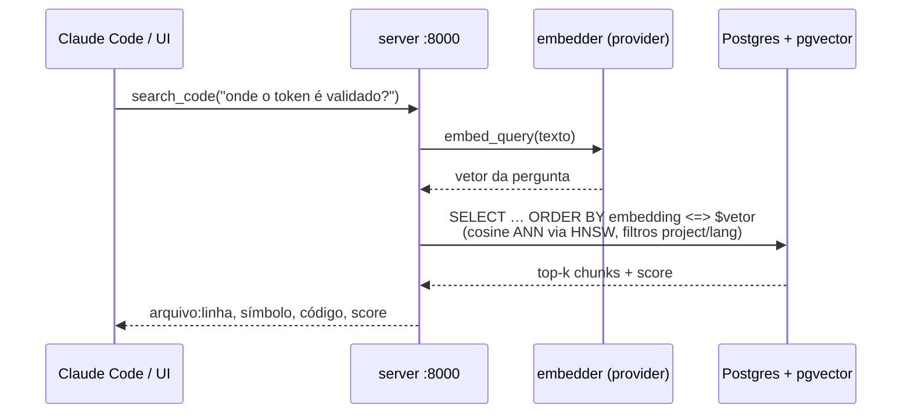

# code-rag

RAG local e **agnóstico** de base de código: aponte para qualquer pasta no seu computador, indexe, e consulte por linguagem natural — via **MCP** (para agentes de IA como o Claude Code) ou pela **UI web**.

Tudo roda **100% local** via Docker: Postgres + pgvector para busca vetorial, embeddings in-process via fastembed/ONNX (por padrão — sem nenhum serviço externo), e um servidor FastAPI que expõe UI, API JSON e MCP.

## Arquitetura



### Fluxo de indexação (`make index DIR=/pasta`)



### Fluxo de consulta



## Quickstart

```bash
make up                                  # sobe postgres + servidor
make index DIR=/caminho/da/sua/base      # indexa qualquer pasta (nome = basename da pasta)
make index DIR=/outro/projeto NAME=meu-projeto   # nome customizado
```

> Na primeira indexação o modelo de embedding (~130MB) é baixado do Hugging Face e cacheado num volume Docker.

Pronto:

- **UI**: http://localhost:8000 — barra de busca em linguagem natural
- **MCP**: http://localhost:8000/mcp

### Registrar o MCP no Claude Code

```bash
claude mcp add --transport http code-rag http://localhost:8000/mcp
```

Ferramentas expostas:

| Tool | O que faz |
|---|---|
| `search_code(query, project?, lang?, top_k?)` | Busca semântica por linguagem natural |
| `find_symbol(symbol, project?, top_k?)` | Localiza função/classe/método pelo nome |
| `list_projects()` | Lista os projetos indexados |

## Embeddings agnósticos

Nenhum modelo é fixo. O provider é escolhido por env var (`.env`), e a **dimensão do vetor é auto-detectada** na primeira indexação:

| Provider | Config | Exemplos de modelo |
|---|---|---|
| `fastembed` (padrão — in-process, ONNX/CPU, zero serviços) | — | `BAAI/bge-small-en-v1.5` (leve), `jinaai/jina-embeddings-v2-base-code` (melhor p/ código) |
| `ollama` (local, requer container/host Ollama) | `OLLAMA_URL` | `nomic-embed-text`, `mxbai-embed-large`, `bge-m3` |
| `openai` (qualquer API OpenAI-compatible) | `OPENAI_BASE_URL`, `OPENAI_API_KEY` | `text-embedding-3-small`, LM Studio, vLLM, Together… |
| `gemini` | `GEMINI_API_KEY` | `gemini-embedding-001` |

Trocar de modelo:

```bash
# edite .env (EMBEDDING_PROVIDER / EMBEDDING_MODEL), depois:
make reset-db     # embeddings de modelos diferentes são incompatíveis
make up
make index DIR=…  # reindexe
```

> **Ollama no host** (em vez do container): no `.env`, deixe `COMPOSE_PROFILES=` vazio e use `OLLAMA_URL=http://host.docker.internal:11434`.

## Como funciona a indexação

1. **Walk**: percorre a pasta ignorando `node_modules`, `.git`, `vendor`, builds, locks e binários.
2. **Chunking**:
   - **Python, Go, TypeScript/TSX, JavaScript** → tree-sitter, chunks por símbolo (função, método, classe, struct, interface).
   - **Qualquer outra linguagem/texto** (Rust, Java, Vue, SQL, Markdown, YAML…) → janela de ~100 linhas com sobreposição.
3. **Dedup**: chunks cujo conteúdo não mudou reutilizam o embedding do banco (reindexar é barato).
4. **Embed + gravação**: batches para o provider configurado → `pgvector` com índice HNSW (cosine).

Reindexar é só rodar `make index DIR=…` de novo — o índice do projeto é substituído atomicamente.

## Comandos

```bash
make up          # sobe tudo (build + pull do modelo)
make index DIR=/caminho [NAME=nome]
make logs        # logs do servidor
make ps          # status
make down        # derruba
make reset-db    # APAGA o banco (trocou de modelo de embedding? rode isso)
make backup      # dump comprimido do banco (protege a carga de embeddings)
make restore FILE=/caminho/backup.dump   # restaura um backup
make mcp-stdio   # servidor MCP via stdio (alternativa ao HTTP)
```

## Endpoints da API

```
GET /api/search?q=...&project=...&lang=...&top_k=10
GET /api/projects
GET /api/langs
GET /health
```

## Estrutura

```
app/
├── main.py              # CLI: serve | index | mcp
├── config.py            # settings via env
├── db.py                # asyncpg + schema (dimensão auto-detectada)
├── embeddings/          # camada agnóstica: ollama | openai | gemini
├── indexer/
│   ├── walker.py        # descoberta de arquivos
│   ├── chunkers/        # tree-sitter + genérico
│   └── pipeline.py      # walk → chunk → dedup → embed → gravar
├── search.py            # busca vetorial + símbolos
├── mcp_server.py        # FastMCP: search_code, find_symbol, list_projects
└── web/                 # FastAPI + UI estática
```
